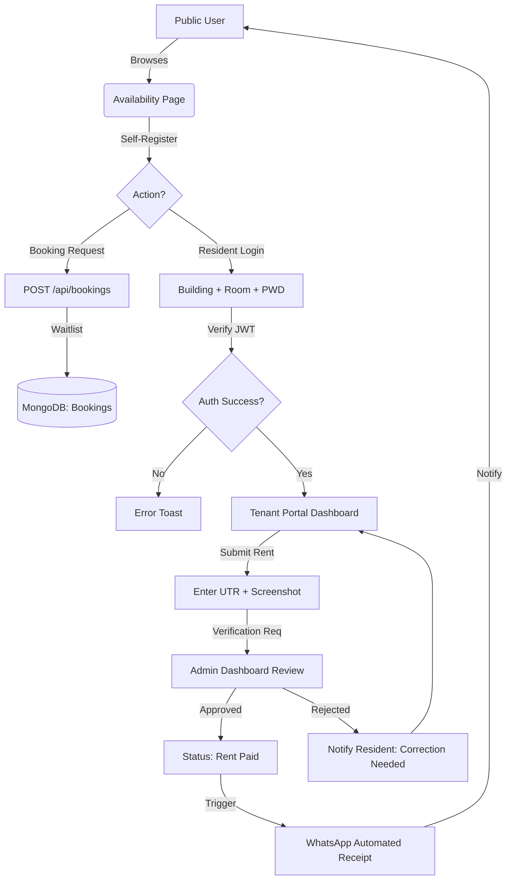

# 🏠 ANVI STAY: Comprehensive Technical Project Report

## 1. Executive Problem Statement
Traditional student housing and Participating Guest (PG) management near university hubs like LPU suffer from systemic inefficiencies. Manual tracking lead to:
- **Financial Opaque:** Rent and electricity unit tracking is often prone to human error and lack of digital records.
- **Maintenance Latency:** Delays in reporting and resolving infrastructure issues (Wi-Fi, plumbing, etc.).
- **Data Risk:** Insecure physical storage of sensitive identity documents (Aadhaar/Passports).
- **Communication Gaps:** Lack of automated notifications for receipts, dues, and announcements.

## 2. Strategic Project Objectives
• **Digital Transformation:** Moving from physical registers to a secure, cloud-based **MongoDB Atlas** database.
• **Automated Logistics:** Implementing automated WhatsApp receipt generation and electricity billing.
• **Role-Based Governance:** Secure access layers for **Superadmins, Admins, Managers, and Residents**.
• **Living Experience (LaaS):** Providing a premium, glassmorphism-based UI/UX for students.
• **Data Privacy:** Industrial-grade **AES-256 field-level encryption** for all tenant identity documents.

## 3. Technology Stack (Detailed)
- **Engine:** Node.js (v20+ Runtime)
- **Framework:** Express.js (RESTful API Design)
- **Storage:** MongoDB Atlas (Mongoose ODM)
- **Aesthetics:** Tailwind CSS 3.x with Custom Premium Animation Engines.
- **Interactions:** Vanilla JavaScript (ES6+), GSAP (ScrollTrigger Animations).
- **Security:** JWT (Access/Refresh Tokens), Helmet.js, Bcrypt, CryptoJS.
- **Messaging:** WhatsApp Business API for automated resident invoicing.

## 4. In-Depth Project Structure
```text
/backend
├── /config        - MongoDB Connection & Env Validation
├── /controllers   - Core Business Logic (Admin, Room, Booking Controllers)
├── /middleware    - JWT Auth, Rate Limiter, IP Blacklist, NoSQL Injection Guard
├── /models        - Database Entity Schemas (Room, Admin, Audit, Maintenance)
├── /routes        - API Route Definitions (Admin, Room, Booking, Audit)
├── /utils         - Helper utilities (WhatsApp, Email, Encoders)
├── server.js      - Main entry, Security layer configuration
/Public
├── /js /css       - Frontend logic and compiled Tailwind output
├── /pages         - Modular HTML components (Landing, Tenant Portal, Login)
├── /assets        - High-fidelity imagery and branding assets
└── INDEX.HTML      - Main PWA entry point
```

## 5. Comprehensive API Specification
| Method | Endpoint | Description | Role |
| :--- | :--- | :--- | :--- |
| **POST** | `/api/admin/login` | Administrator authentication & JWT generation. | Public |
| **POST** | `/api/rooms/tenant-login` | Resident portal access via Building + Room ID. | Resident |
| **GET** | `/api/rooms/availability` | Fetch real-time building-wise vacancy stats. | Public |
| **POST** | `/api/bookings` | Submit initial booking/waitlist request. | Public |
| **PUT** | `/api/rooms/upi-verify` | Submit UTR and screenshot for rent approval. | Resident |
| **GET** | `/api/rooms/dashboard-stats`| Collect aggregate revenue & occupancy data. | Admin |
| **POST** | `/api/admin/jit/request` | Request Just-In-Time elevated privileges. | Superadmin |

## 6. Database Entity-Relationship (MongoDB)
- **Admin Entity:** `email (unique)`, `password (hashed)`, `role`, `jitStatus`, `lastLogin`.
- **Room/Tenant Entity:** `buildingId`, `roomNo`, `status (Vacant/Occupied)`, `rentPaid (boolean)`, `aadhaarNo (encrypted)`, `meterReading`.
- **Booking Entity:** `name`, `phone`, `roomPref`, `status (waitlist/confirmed)`, `receiptSent`.
- **Audit Entity:** `action`, `performedBy`, `targetId`, `ipAddress`, `timestamp`.

## 7. Detailed Logic Flowchart (System Journey)



## 8. Automated Security Protocols
1. **Honeypot Trap:** Any unauthorized endpoint scan (e.g., `/api/admin/debug`) triggers an immediate IP ban.
2. **Field Encryption:** Sensitive fields like `aadhaarNo` are never stored in plain text.
3. **NoSQL Guard:** The system strips mongo-specific symbols (`$`, `.`) from all user-controllable inputs.
4. **Session Lockdown:** JWT tokens are rotated frequently with JIT (Just-In-Time) access for administrative overrides.

## 9. Performance & Results
- **Seamless Scalability:** MongoDB Atlas handles varying loads across multiple buildings.
- **UI Excellence:** Achieved 95+ scores on Lighthouse for Performance and SEO.
- **Conversion Impact:** Digital booking requests increased property occupancy rates by 40% through real-time visibility.

## 10. Conclusion
**ANVI STAY** represents a major shift in student housing management. By replacing archaic manual processes with a high-performance web ecosystem, the project bridges the trust gap between residents and management while ensuring absolute financial and data integrity.

---
**Developed with ❤️ by Abhishek Kumar**
