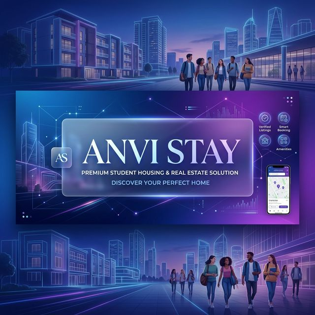
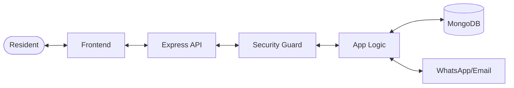

<!-- banner -->

  
   
  <h1>🏠 ANVI STAY</h1>
  
<b>We Listen, We Care, You Stay.</b>

  
<i>Premium student housing & Paying Guest (PG) management platform defined by tech-driven living.</i>

  <!-- Badges -->
  

    
    
    
  

## 🌌 The Vision
**ANVI STAY** is not just an accommodation; it's a technology-enhanced lifestyle. We've built a futuristic PG management ecosystem that prioritizes student comfort, security automation, and absolute transparency between tenants and landlords.

---

## ✨ Overview
**ANVI STAY** is a next-generation PG management solution designed for students and landlords. It offers a seamless, highly interactive experience for discovering and managing premium accommodations near university campuses.

## 🚀 Key Features

### 🌟 For Guests & Tenants
- **🔍 Smart Search & Filtering:** Find the perfect room based on your preferences.
- **📱 PWA Ready:** Install ANVI STAY as a native app on your home screen.
- **💎 Premium UI/UX:** Enjoy smooth scroll-triggered animations and sleek glassmorphism effects.
- **🗺️ Interactive Guidance:** Never get lost with our integrated maps and landmark guides.
- **🔗 Quick Connect:** Directly message landlords or the founder via integrated WhatsApp and socials.

### 🛠 For Administrators (Landlords)
- **🔐 Secure Portals:** Role-based access for Admins, Superadmins, and Managers.
- **🏙 Property Management:** Easily update room details, availability, and documents.
- **🧾 Instant Receipts:** Automated receipt generation and dues tracking.
- **🛡 Advanced Security:** Rate limiting, NoSQL injection protection, and JWT-based session security.

---

## 🔥 Stunning Living Experience
Explore a world of premium student housing through our high-fidelity interface.

  
  
<i>Experience modern glassmorphism UI with smooth, kinetic scroll animations.</i>

### 🌟 Resident Features
- **🕵️‍♂️ Intelligent Discovery**: Real-time room filtering and status checks.
- **📱 PWA Innovation**: Install ANVI STAY as a native app for instant updates.
- **🎭 Visual Excellence**: Premium glassmorphism, staggered animations, and kinetic typography.
- **📍 Landmark Precision**: Integrated map guidance with live landmark walking distances.
- **💬 Direct Reach**: Integrated WhatsApp connectivity for immediate support.

---

## 🛡️ Robust Control Center
Empower landlords and managers with a central command hub.

  
  
<i>A data-driven dashboard for tracking occupancy, dues, and security.</i>

### 🔧 Management Tools
- **🔒 Role-Based Security**: Grainular access for Admins, Superadmins, and Managers.
- **📈 Live Analytics**: Track revenue trends, occupancy rates, and pending tickets.
- **🧾 Automated Logistics**: Instant digital recipes, rent reminders, and document storage.
- **🔥 Security Enforcement**: JWT session lockdown, NoSQL injection protection, and rate limiting.

---

## 🛠 Tech Mastery

| Layer | Tools |
| :--- | :--- |
| **🎨 Design** |    |
| **⚙️ Logic** |    |
| **🛡 Security** |    |
| **📦 Data** |  |
| **🚀 Tools** |  |

---

## 🏗 System Flow

---

## 🏁 Quick Launch

1. **Clone**: `git clone https://github.com/Abhi-2636/ANVI-STAY.git`
2. **Install**: `cd backend && npm install`
3. **Configure**: Set `MONGO_URI` and `JWT_SECRET` in `backend/.env`
4. **Ignite**: `npm run dev`

---

  <h3>Developed with ❤️ by Abhishek Kumar</h3>
  
Connect with me on:

  
  

  

